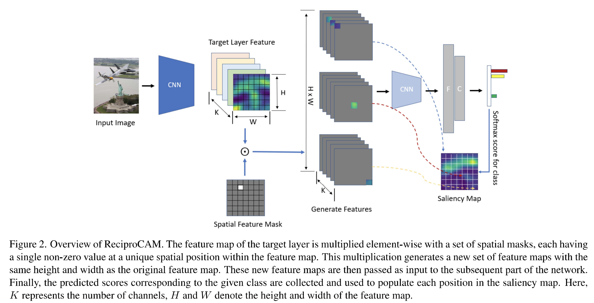
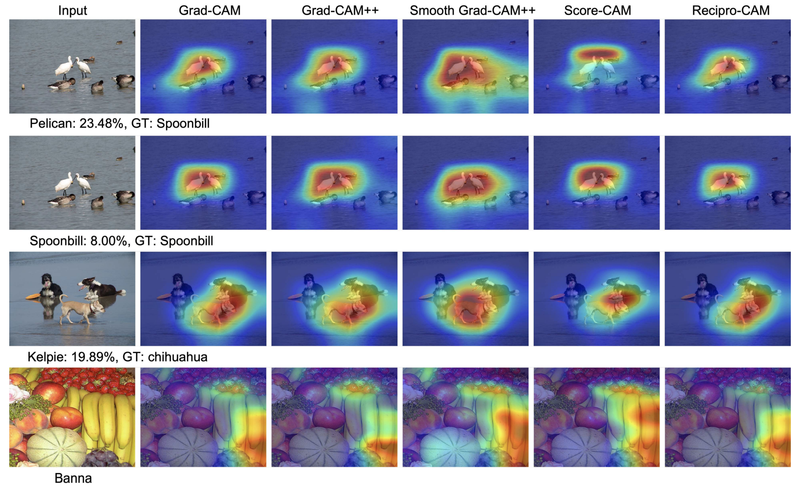
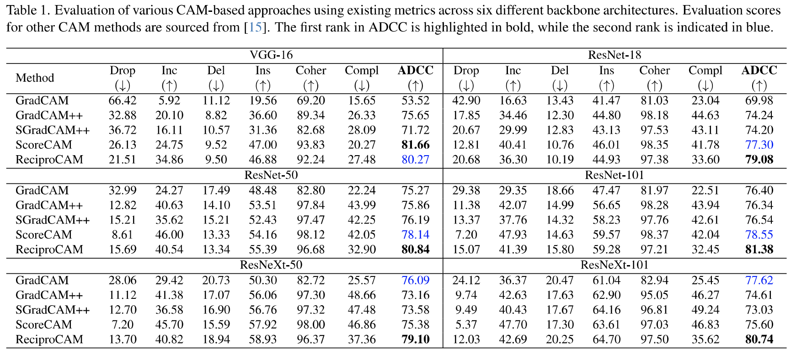

# ReciproCAM

ReciproCAM is a lightweight, gradient-free method for generating Class Activation Maps (CAMs) to provide visual explanations for neural network predictions. This repository contains the implementation of ReciproCAM, as introduced in the paper:

> **ReciproCAM: [Lightweight Gradient-free Class Activation Map for Post-hoc Explanations](https://openaccess.thecvf.com/content/CVPR2024W/XAI4CV/papers/Byun_ReciproCAM_Lightweight_Gradient-free_Class_Activation_Map_for_Post-hoc_Explanations_CVPRW_2024_paper.pdf)**  
> *Authors: Seok-Yong Byun, Wonju Lee*  
> Published in: CVPR 2024 Workshops

## Introduction

Traditional visual explanation methods, such as CAM and Grad-CAM, often have limitations due to their dependency on gradients or architectural constraints. ReciproCAM addresses these challenges with a novel, lightweight, and gradient-free approach to generate CAMs. 

### Key Features
- **Gradient-Free**: Eliminates the need for gradient computations, making it compatible with a wide range of models.
- **Lightweight**: Designed for high-speed execution, significantly outperforming many existing gradient-free methods.
- **Effective**: Produces reliable and coherent visual explanations, demonstrating strong results on metrics like Average Drop-Coherence-Complexity (ADCC).

ReciproCAM uses spatial perturbations on feature maps to exploit the correlation between activations and model outputs, enabling fast and interpretable saliency maps.



## Qualitative comparison 



## Quntative comparison 



## Installation

To use ReciproCAM, clone this repository and install the required dependencies:

```bash
git clone https://github.com/sybyun/ReciproCAM.git
cd ReciproCAM
pip install -r requirements.txt
```

## Jupyter Notebook Example

Check out the [ReciproCAM Notebook](./recipro_cam_test.ipynb) for step-by-step examples.

## Citation
```bibtex
@inproceedings{byun2024reciprocam,
  title={ReciproCAM: Lightweight Gradient-free Class Activation Map for Post-hoc Explanations},
  author={Byun, Seok-Yong and Lee, Wonju},
  booktitle={Proceedings of the IEEE/CVF Conference on Computer Vision and Pattern Recognition (CVPR) Workshops},
  month={June},
  year={2024}
}
